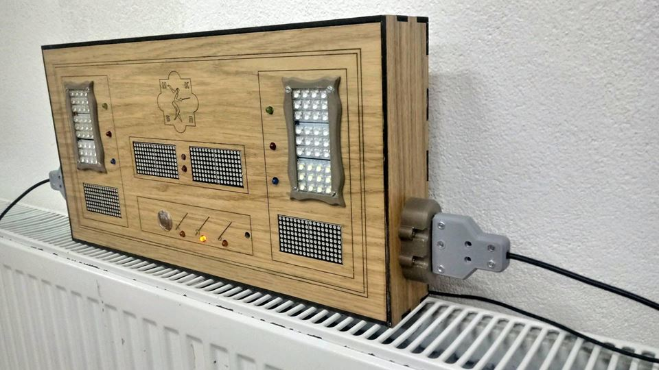

# fencing_scoring_box
## Fencing Scoring Box

On this place I will try to maintain code changes and other files for my version of fencing scoring box.

It is based on two arduinos, one to register hits and second to take care of display, timer and remote control.

First test run of machine you can see on https://youtu.be/ZYt0c06OIwA

